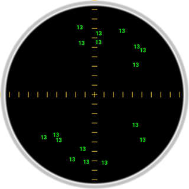

# Exterminator

## Description
The **Exterminator** scans for the number 13 hidden within the patterns of your **room** so you can eliminate them. Like in the Ghostbusters movie. Hurry or they will overload the circuits.

- Controls: click/tap
- Tested on: Android (Chrome/Firefox) in portrait mode.
- 💃 [Live](https://bacionejs.github.io/exterminator)
- 🍔 [YouTube](http://www.youtube.com/@bacionejs)
- 🍕 [Code](https://github.com/bacionejs/exterminator)
- 🍨 [Post-mortem](https://github.com/bacionejs/exterminator#post-mortem)
- 🍩 [Developer Notes](https://github.com/bacionejs/exterminator#developer-notes)

Note:
- This device uses the camera so make sure it has **permission** for your browser.
- Make sure the **lights** are on and that you have camera/video enabled in apps/chrome and chrome/settings.
- After you click **Scan**, you should get some **detections**. If not, then move your phone back and forth. When you get some detections, you can click the scope to **Capture** them. Once captured, you must quickly **smash** them because they are not happy and will begin to zip around faster and faster until they **overload** your circuits.
- Warning: Consumer protection groups have found that this device doesn't actually work to eliminate the number 13 from your environment. But if it makes you feel better, that is all that matters 🐲

---

## Purpose
- Competition: [js13kgames](https://js13kgames.com)
- Theme: The 2024 theme is Triskaidekaphobia (fear of the number 13)
- Goal: Win a t-shirt 🏆🎉

---

## Post-mortem

- Day 1: Finished the core game 💥
- Day 2: Added Scope

and... 🎬

After submitting my first entry, in the last few days of the competition, I decided to try for one more.

An idea had been itching my brain: NPCs and players can't have phobias. We needed something to use in *our* environment.

I've always wanted to do something with the camera feed. My first thought was that the player had to make the shape of the number 13 with their body. But that wasn't possible without using a huge library like tensorflow.

So I went with simple edge detection to fake the idea that you where finding and exterminating 13s. The idea still makes me laugh. If you ever see someone at the airport pointing their phone at something and then smashing away, maybe it is my game.

I spent a lot of time on a retro instrument panel. The procedurally generated leather effect alone took hours. And the dials, toggles and sliders a few hour more. But the end result was ugly. Time wasted.

So I went with something plain. But a user said that it looked like a coffee cup so i added cross hairs. Another user said the green blobs should be number 13s so I changed that.

## Developer Notes
todo
